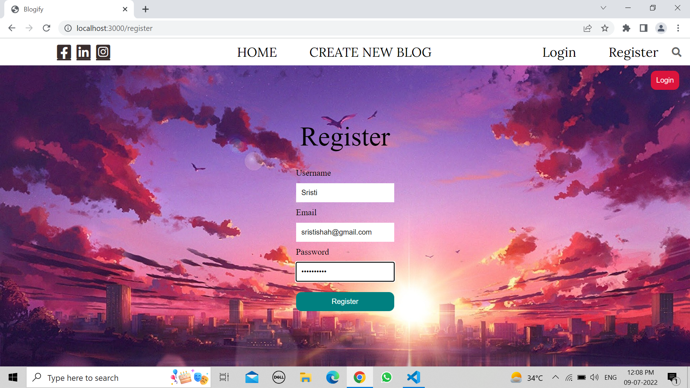
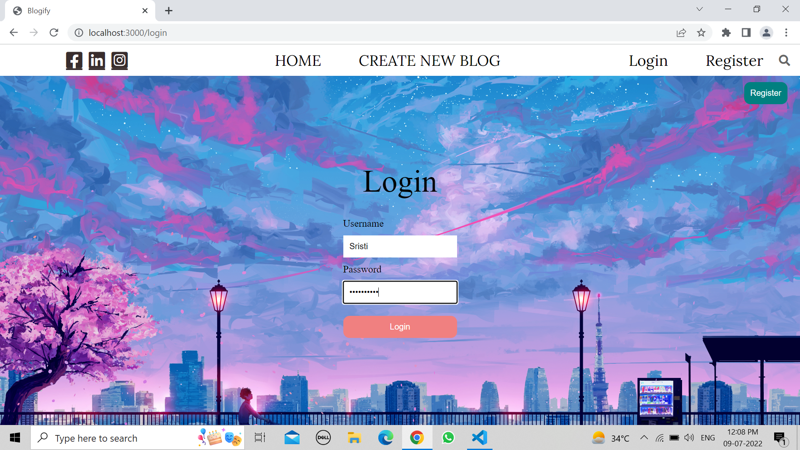
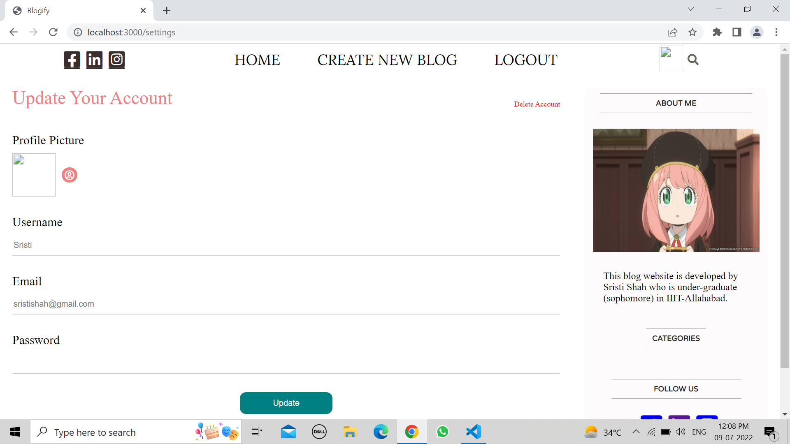
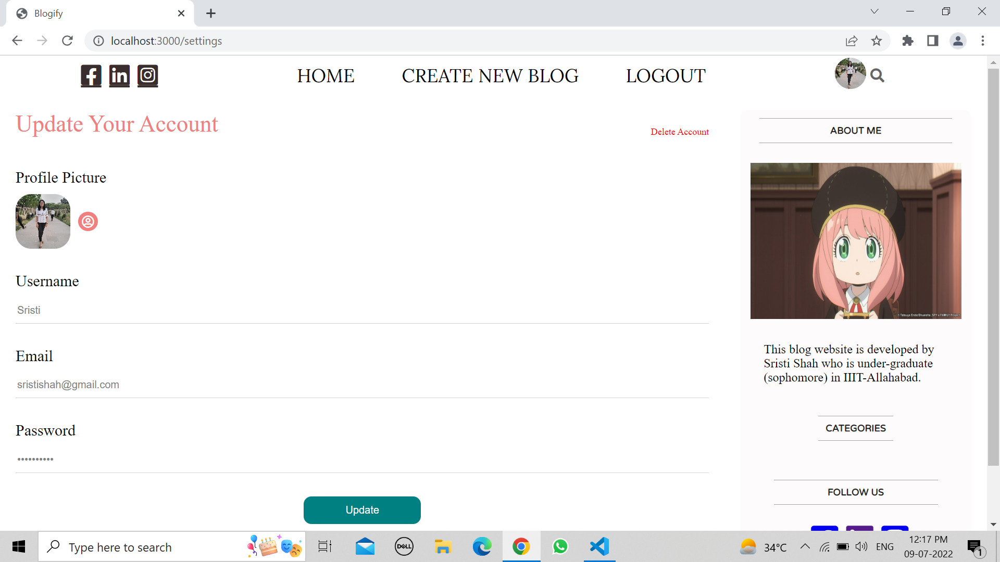
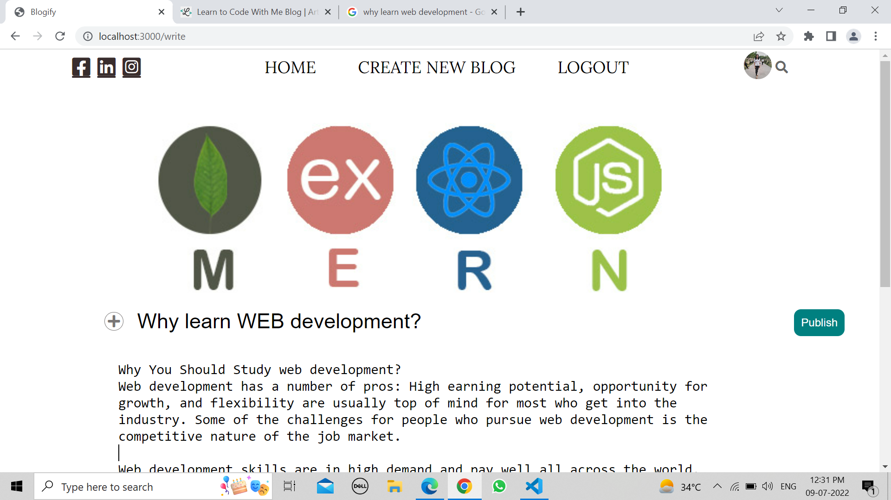
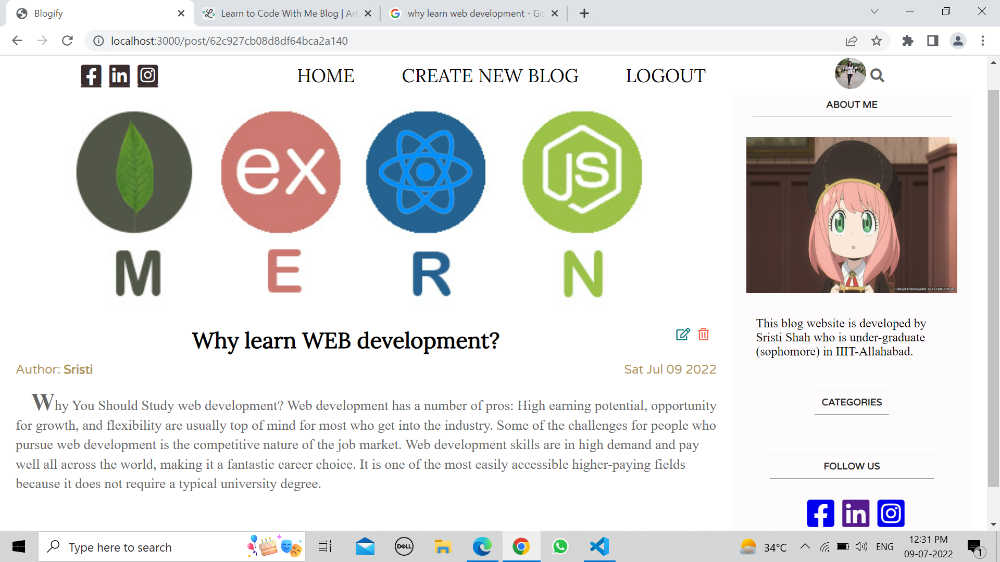
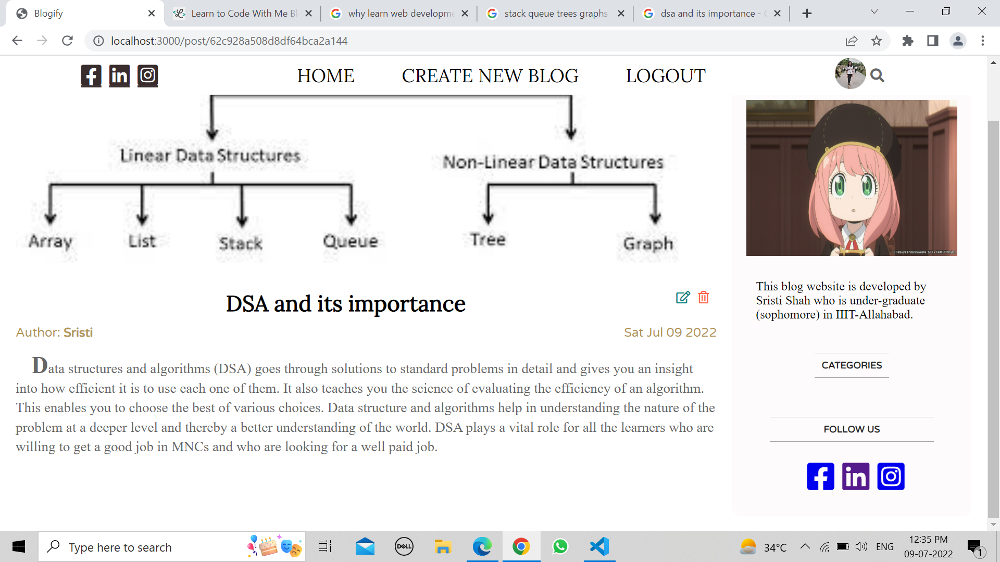
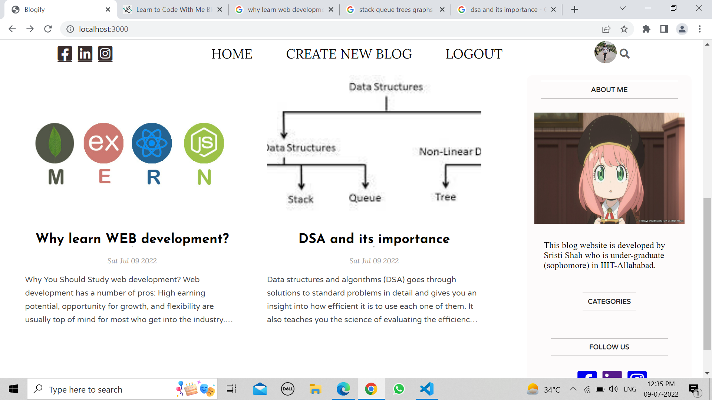
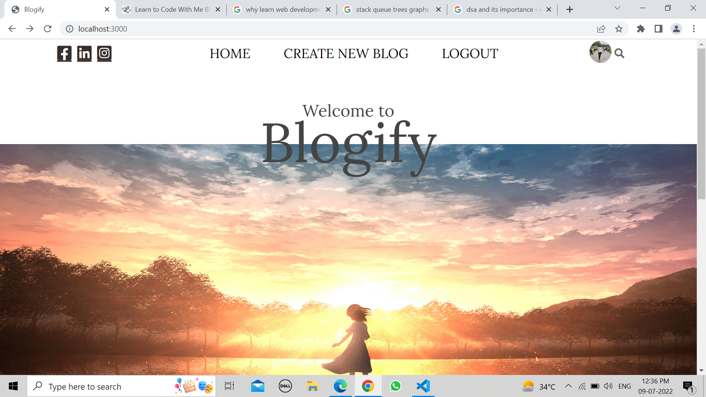

<h1 align='center'>BLOGIFY</h1>

## About the Website

- <b>'BLOGIFY'</b>  is a web application which helps a registered user to create new blogs to hare their idea,stories,experiences and thoughts with a wide range of people just by posting them on this website.
- <b>Languages and Technologies used : </b> MongoDB,Nodejs,React,HTML & CSS


## Steps to run the website

**To run the web app on your local computer, clone this repository-**

**1.Open the terminal in the client directory and run the following command :**
```npm i```
```npm start```

**2.Open the terminal in the api directory and run the following command :**
```nodemon ./index.js```


Open your favorite browser. I recommend using Google Chrome or Brave and the app will get opened on http://localhost:3000/


## Screenshots

<h3 align='center'>Home Page</h3>


<h3 align='center'>Click on register button and register page opens up</h3>



<h3 align='center'>After registering, go to login page</h3>



<h3 align='center'>Now, update your profile by adding Profile picture</h3>





<h3 align='center'>Now click on CREATE NEW BLOG . Write your blog,and also add an image if you want.</h3>



<h3 align='center'>This is how the screen will look like.</h3>



<h3 align='center'>Add another blog if you want.</h3>



<h3 align='center'>This is how the screen will look like</h3>



<h3 align='center'>You can logout by clicking on logout button.</h3>




<h2 align='center'>Hope you have a great blogging experience!!!!</h2>
